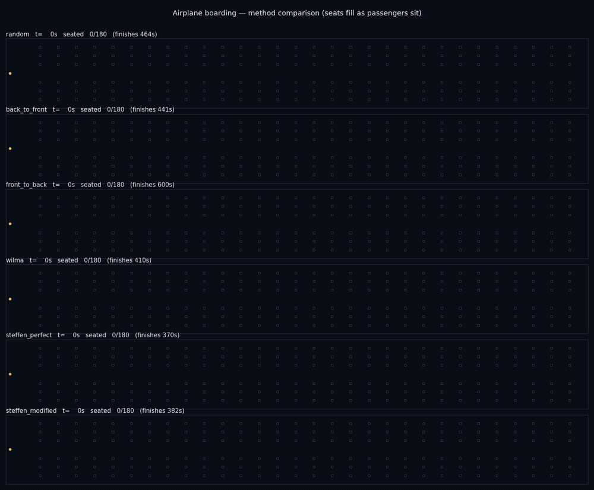

# boarding — Steffen airplane boarding-method study

Reproduces Steffen (2008, [arXiv:0802.0733](https://arxiv.org/abs/0802.0733)),
*Optimal boarding method for airline passengers*, in [JuPedSim](https://www.jupedsim.org/).
A standalone study that **uses** [`jupedsim-scenarios`](https://github.com/PedestrianDynamics/jupedsim-scenarios)
(for its direct-steering helpers) but is not part of it.

## What it does

Compares six boarding methods — random, back-to-front, front-to-back, WilMA (outside-in),
Steffen-Perfect, Steffen-Modified — on a single-aisle 30×6 (180-passenger) cabin, and reports the
boarding-time ranking. The model is **logical seating**: agents walk a single-file aisle to their
row, hold for `luggage + seat-interference` time (blocking followers), then sit logically. This
reproduces Steffen's *ranking* (Steffen fastest, back-to-front ≈ random, front-to-back worst); see
`docs/results.md`.

### Is this 1-D?

The **aisle** is effectively 1-D: it is 0.5 m wide, so two 0.36 m-wide agents cannot pass — motion
is strictly single-file along the cabin's length. That matches Steffen's original 1-D
cellular-automaton model, and it is why a raw trajectory replay looks like a single bar. The
simulation itself is JuPedSim's full **2-D continuous** dynamics (collision avoidance, finite body
size), and the **seats** live at 2-D coordinates off the aisle — they are labels for the
interference penalty, not navigated. The comparison video (below) shows the 2-D cabin with those
seats filling over time.

## Install

```bash
python -m venv .venv && source .venv/bin/activate
pip install -e ".[dev]"
```

This pulls `jupedsim` and `jupedsim-scenarios` from PyPI.

## Run the study

```bash
python -m boarding --seeds 20 --rows 30 --out study-output
# or a quick check:
python -m boarding --methods random steffen_perfect --seeds 3 --rows 30 --out /tmp/boarding
```

Outputs `results.csv`, `ranking.csv`, `boarding_times.png`.

## Results

Full 30-row (180-passenger) cabin, 20 paired seeds per method
(`python -m boarding --seeds 20 --rows 30 --out study-output`):

| Rank | Method            | Mean boarding time (s) | Std (s) | vs Steffen-Perfect |
|------|-------------------|------------------------|---------|--------------------|
| 1    | steffen_perfect   | 371.0                  | 3.2     | 1.00×              |
| 2    | steffen_modified  | 378.9                  | 5.2     | 1.02×              |
| 3    | wilma             | 402.2                  | 9.6     | 1.08×              |
| 4    | back_to_front     | 443.0                  | 12.3    | 1.19×              |
| 5    | random            | 455.9                  | 13.0    | 1.23×              |
| 6    | front_to_back     | 615.0                  | 18.5    | 1.66×              |

This reproduces Steffen's ranking: **Steffen-Perfect is fastest**, **Back-to-Front is no better
than Random** (his central counter-intuitive result), and **Front-to-Back is worst**. JuPedSim's
continuous 2-D dynamics compress the absolute ratios versus Steffen's idealized 1-D model, so the
deliverable is the *ranking and relative ordering*, not the absolute "~4×" figure. Artifacts in
`docs/study-output/`; full write-up in `docs/results.md`.


## Visualize

One SQLite trajectory per method (seed 1, full 30-row cabin) is committed under
`docs/study-output/trajectories/` — open any of them in
[jpsvis](https://www.jupedsim.org/) or the Web-Based-JuPedSim app to watch the aisle
flow. With logical seating, agents queue and hold in the single-file aisle and leave at
their row, so the trajectories show the *boarding/queueing dynamics* (not seats filling).
The contrast is clearest between `steffen_perfect.sqlite` (spread out, fast) and
`front_to_back.sqlite` (jammed behind front holders, slow).

Regenerate them with:

```bash
python -m boarding --seeds 1 --rows 30 --out study-output --trajectories 1
```

### Method-comparison video

`docs/study-output/comparison.mp4` shows all six methods at once — one panel each, seats
filling (teal) as passengers sit, aisle passengers in yellow, with a live `seated N/180`
counter and each method's finish time. Watch the Steffen variants pull ahead while
front-to-back jams. Build it with:



Full-quality MP4: [`docs/study-output/comparison.mp4`](docs/study-output/comparison.mp4).
Build it with (requires `ffmpeg` on PATH):

```bash
python -m boarding.visualize --seed 1 --rows 30 --out docs/study-output/comparison.mp4
```

## Test

```bash
pytest
```

## Layout

- `src/boarding/` — `config`, `geometry` (aisle-only), `methods` (orderings), `choreography`
  (per-agent state machine + penalties), `experiment` (`run_boarding` + `sweep`), `analysis`,
  `seat_placement` (post-hoc seat-fill table), `cli`.
- `docs/` — design spec, implementation plan, results write-up, and a committed study run under
  `docs/study-output/`.

> Note: `docs/design-spec.md` and `docs/implementation-plan.md` reference the original
> `jupedsim-scenarios` paths where this work was first developed; they are kept as the design
> record. The canonical code is here under `src/boarding/`.
