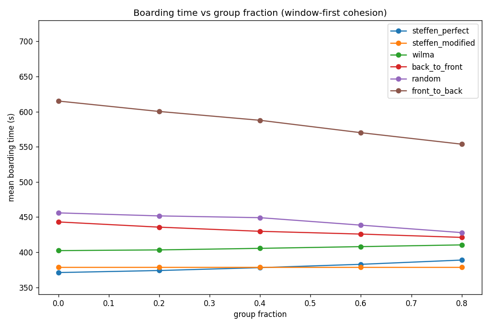
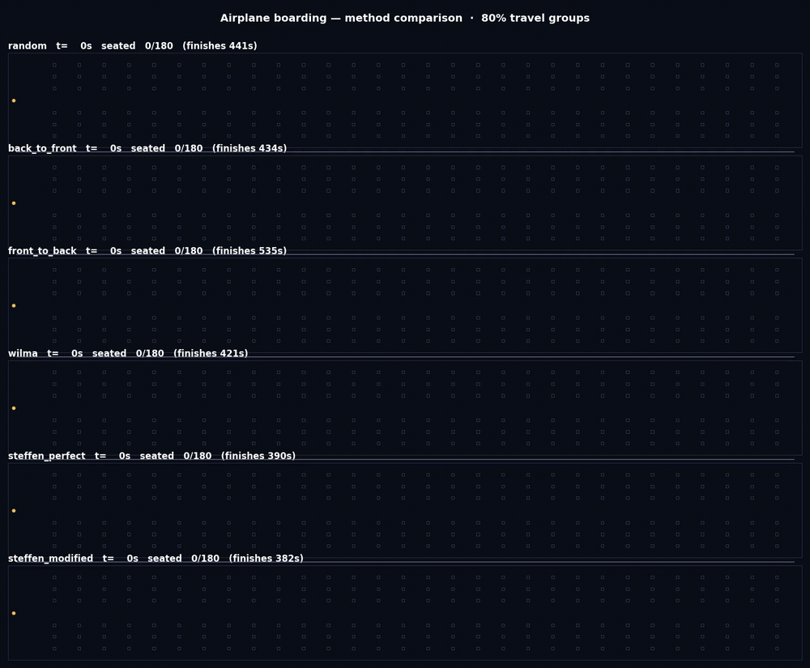
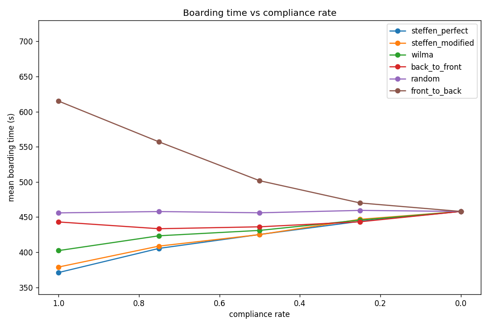
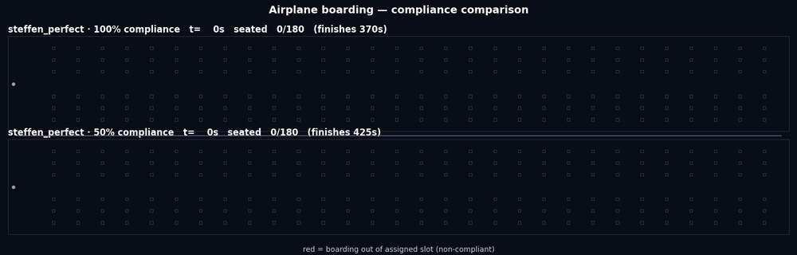

# boarding — Steffen airplane boarding-method study

Reproduces Steffen (2008, [arXiv:0802.0733](https://arxiv.org/abs/0802.0733)),
*Optimal boarding method for airline passengers*, in [JuPedSim](https://www.jupedsim.org/).
A standalone study that **uses** [`jupedsim-scenarios`](https://github.com/PedestrianDynamics/jupedsim-scenarios)
(for its direct-steering helpers) but is not part of it.

## What it does

Compares six boarding methods — random, back-to-front, front-to-back, WilMA (outside-in),
Steffen-Perfect, Steffen-Modified — on a single-aisle 30×6 (180-passenger) cabin, and reports the
boarding-time ranking. The model is **logical seating**: agents walk a single-file aisle to their
row, hold for `luggage + seat-interference` time (blocking followers), then sit logically. This
reproduces Steffen's *ranking* (Steffen fastest, back-to-front ≈ random, front-to-back worst); see
`docs/results.md`.

### Is this 1-D?

The **aisle** is effectively 1-D: it is 0.5 m wide, so two 0.36 m-wide agents cannot pass — motion
is strictly single-file along the cabin's length. That matches Steffen's original 1-D
cellular-automaton model, and it is why a raw trajectory replay looks like a single bar. The
simulation itself is JuPedSim's full **2-D continuous** dynamics (collision avoidance, finite body
size), and the **seats** live at 2-D coordinates off the aisle — they are labels for the
interference penalty, not navigated. The comparison video (below) shows the 2-D cabin with those
seats filling over time.

## Install

```bash
python -m venv .venv && source .venv/bin/activate
pip install -e ".[dev]"
```

This pulls `jupedsim` and `jupedsim-scenarios` from PyPI.

## Run the study

```bash
python -m boarding --seeds 20 --rows 30 --out study-output
# or a quick check:
python -m boarding --methods random steffen_perfect --seeds 3 --rows 30 --out /tmp/boarding
```

Outputs `results.csv`, `ranking.csv`, `boarding_times.png`.

## Results

Full 30-row (180-passenger) cabin, 20 paired seeds per method
(`python -m boarding --seeds 20 --rows 30 --out study-output`):

| Rank | Method            | Mean boarding time (s) | Std (s) | vs Steffen-Perfect |
|------|-------------------|------------------------|---------|--------------------|
| 1    | steffen_perfect   | 371.0                  | 3.2     | 1.00×              |
| 2    | steffen_modified  | 378.9                  | 5.2     | 1.02×              |
| 3    | wilma             | 402.2                  | 9.6     | 1.08×              |
| 4    | back_to_front     | 443.0                  | 12.3    | 1.19×              |
| 5    | random            | 455.9                  | 13.0    | 1.23×              |
| 6    | front_to_back     | 615.0                  | 18.5    | 1.66×              |

This reproduces Steffen's ranking: **Steffen-Perfect is fastest**, **Back-to-Front is no better
than Random** (his central counter-intuitive result), and **Front-to-Back is worst**. JuPedSim's
continuous 2-D dynamics compress the absolute ratios versus Steffen's idealized 1-D model, so the
deliverable is the *ranking and relative ordering*, not the absolute "~4×" figure. Artifacts in
`docs/study-output/`; full write-up in `docs/results.md`.


## Passenger heterogeneity (time-to-sitting)

Steffen's perfect method assumes interchangeable passengers in a flawless single-file order — a
common real-world criticism. The `--mix` flag assigns each passenger a profile (standard, fast/young,
heavy-luggage, elderly, family-with-kids) that modulates walk speed, stow time, and shuffle speed,
then re-runs the comparison:

```bash
python -m boarding --mix --seeds 20 --rows 30 --out study-output
```

Under a realistic mix, **Steffen-Modified overtakes Steffen-Perfect** as the fastest method, and
Steffen-Perfect is the *most* heterogeneity-sensitive optimized method (+8.8% vs +3.4%). Its tightly
choreographed spacing depends on uniform passengers; coarser grouping has slack to absorb slow ones.

| Rank | Method | Mean (s) | vs homogeneous |
|------|--------|----------|----------------|
| 1 | steffen_modified | 391.9 | +3.4% |
| 2 | steffen_perfect | 403.6 | +8.8% |
| 3 | wilma | 449.6 | +11.8% |
| 4 | back_to_front | 490.8 | +10.8% |
| 5 | random | 511.3 | +12.2% |
| 6 | front_to_back | 688.6 | +12.0% |


Full-quality MP4: [`docs/study-output/comparison_mix.mp4`](docs/study-output/comparison_mix.mp4)
(`python -m boarding.visualize --mix --seed 1 --rows 30 --out docs/study-output/comparison_mix.mp4`).
Full discussion in [`docs/results-heterogeneous.md`](docs/results-heterogeneous.md); design in
[`docs/heterogeneous-profiles-design.md`](docs/heterogeneous-profiles-design.md).

## Travel groups (boarding-order cohesion)

The other half of Steffen's real-world problem: travel parties board **together** and can't be slotted
into his perfect window→middle→aisle sequence. The `groupsweep` tool seats a fraction of passengers in
groups of 2–3 that board cohesively (window-first) and sweeps that fraction from 0 to 0.8:

```bash
python -m boarding.groupsweep --seeds 20 --rows 30 --out study-output
```

**Steffen-Perfect is the only method that gets *slower* as groups grow** (371 → 389 s) — clumping a
bench's passengers destroys the spacing its parallelization depends on. **Steffen-Modified is
group-immune** (it already boards benches together) and **overtakes Steffen-Perfect at ~50% groups**.
Across both realism axes (heterogeneous passengers *and* groups), the theoretical optimum is the
fragile one and the practical variant survives — a simulated account of why airlines don't use the
"perfect" method.





Comparison video at 80% groups — full-quality MP4:
[`docs/study-output/comparison_groups.mp4`](docs/study-output/comparison_groups.mp4)
(`python -m boarding.visualize --group-fraction 0.8 --seed 1 --rows 30 --out docs/study-output/comparison_groups.mp4`).
Full discussion in [`docs/results-groups.md`](docs/results-groups.md); design in
[`docs/groups-design.md`](docs/groups-design.md).

## Passenger compliance (order discipline)

A boarding strategy only helps if passengers actually follow it. The `compliancesweep` tool sweeps a
**compliance rate** `Rc` (the share who board in their assigned slot); below 100 %, that fraction of
passengers is displaced to random positions:

```bash
python -m boarding.compliancesweep --seeds 20 --rows 30 --out study-output
```

As compliance falls, **the optimized methods degrade toward Random and all six collapse to the *same*
value at `Rc = 0`** (exactly, since the order becomes method-independent). **Random is flat** and
**Front-to-Back even improves**. Steffen-Perfect's ~85 s edge over Random at full compliance shrinks to
~31 s at 50 % and to 0 at zero. This reproduces the trend of **Dong, Yanagisawa & Nishinari (2025),
Physica A 658, 130298, Fig 16** (a multi-aisle blended-wing-body CA model) on our single-aisle continuous
model — the value of a clever order is entirely contingent on passengers following it.

Mean boarding time (s), 20 paired seeds:

| Rc | steffen_perfect | steffen_modified | wilma | back_to_front | random | front_to_back |
|------|-----------------|------------------|-------|---------------|--------|---------------|
| 1.00 | **371.0** | 378.9 | 402.2 | 443.0 | 455.9 | **615.0** |
| 0.75 | 405.4 | 408.7 | 423.3 | 433.4 | 457.8 | 556.9 |
| 0.50 | 425.2 | 425.0 | 431.0 | 436.1 | 456.0 | 501.7 |
| 0.25 | 443.9 | 446.8 | 445.7 | 443.3 | 459.5 | 470.0 |
| 0.00 | 458.0 | 458.0 | 458.0 | 458.0 | 458.0 | 458.0 |



The same method (`steffen_perfect`) at 100 % vs 50 % compliance — **red dots are the non-compliant
passengers** boarding out of their assigned slot. Both panels share a clock; the 50 % panel finishes
visibly later (≈425 s vs ≈370 s):



Full-quality MP4:
[`docs/study-output/comparison_compliance.mp4`](docs/study-output/comparison_compliance.mp4)
(`python -m boarding.visualize --compliance --method steffen_perfect --compliance-rates 1.0 0.5 --seed 1 --rows 30 --out docs/study-output/comparison_compliance.mp4`).
Full discussion in [`docs/results-compliance.md`](docs/results-compliance.md); design in
[`docs/compliance-design.md`](docs/compliance-design.md).

## Visualize

One SQLite trajectory per method (seed 1, full 30-row cabin) is committed under
`docs/study-output/trajectories/` — open any of them in
[jpsvis](https://www.jupedsim.org/) or the Web-Based-JuPedSim app to watch the aisle
flow. With logical seating, agents queue and hold in the single-file aisle and leave at
their row, so the trajectories show the *boarding/queueing dynamics* (not seats filling).
The contrast is clearest between `steffen_perfect.sqlite` (spread out, fast) and
`front_to_back.sqlite` (jammed behind front holders, slow).

Regenerate them with:

```bash
python -m boarding --seeds 1 --rows 30 --out study-output --trajectories 1
```

### Method-comparison video

`docs/study-output/comparison.mp4` shows all six methods at once — one panel each, seats
filling (teal) as passengers sit, aisle passengers in yellow, with a live `seated N/180`
counter and each method's finish time. Watch the Steffen variants pull ahead while
front-to-back jams. Build it with:


Full-quality MP4: [`docs/study-output/comparison.mp4`](docs/study-output/comparison.mp4).
Build it with (requires `ffmpeg` on PATH):

```bash
python -m boarding.visualize --seed 1 --rows 30 --out docs/study-output/comparison.mp4
```

## Test

```bash
pytest
```

## Layout

- `src/boarding/` — `config`, `geometry` (aisle-only), `methods` (orderings), `choreography`
  (per-agent state machine + penalties), `experiment` (`run_boarding` + `sweep`), `analysis`,
  `seat_placement` (post-hoc seat-fill table), `cli`.
- `docs/` — design spec, implementation plan, results write-up, and a committed study run under
  `docs/study-output/`.

> Note: `docs/design-spec.md` and `docs/implementation-plan.md` reference the original
> `jupedsim-scenarios` paths where this work was first developed; they are kept as the design
> record. The canonical code is here under `src/boarding/`.
