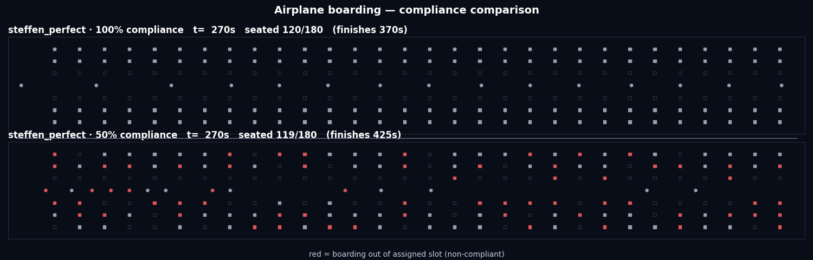

# Why don't airlines board planes the optimal way?

*Cover: the same boarding method at 100% vs 50% compliance. With half the passengers out of their
assigned slot (red), boarding finishes later. For a feed post, `docs/study-output/comparison_compliance.mp4`
plays this as a short video.*

---

In 2008, astrophysicist Jason Steffen worked out the **mathematically optimal way to board an airplane**. It boards passengers in a precise interleaved order — window seats first, every other row — so that many people stow their luggage at the same time and nobody ever has to climb over a seated neighbour. In ideal conditions it's dramatically faster than how airlines actually do it.

A counter-intuitive part of the result is that boarding back-to-front, which many airlines use, is no better than boarding everyone at random, and front-to-back is worse than random.

No airline uses Steffen's method. We rebuilt these studies in [@JuPedSim](https://www.jupedsim.org/), our open-source pedestrian-dynamics simulator, to look at why.

## Step 1 — reproduce the classic ranking

We modelled a single-aisle 180-seat cabin and ran six boarding strategies. Each passenger walks the aisle to their row, holds there while they stow luggage and let neighbours shuffle past (the two things that actually cause boarding delays), then sits. Same geometry, same luggage draws, 20 repetitions per method.

**[Insert: `docs/study-output/comparison.gif`]** — six methods boarding side by side; the Steffen variants pull ahead while front-to-back jams.

The ranking comes out as in the literature: Steffen fastest, back-to-front barely better than random, front-to-back worst.

**[Insert: `docs/study-output/boarding_times.png`]** — boarding time for each method, uniform passengers, 180-seat cabin, 20 runs per method. Each box shows the spread across runs. Steffen-Perfect is fastest and Front-to-Back slowest; Back-to-Front is close to Random.

This reproduces established results. The next question is the one that matters in practice.

## Step 2 — why the optimum stays on paper

Steffen's method assumes 180 strangers will form one perfect single-file queue and board in a strict choreographed order. Real passengers don't. Families board together. People show up late. Not everyone follows the plan.

A very recent paper — **Dong, Yanagisawa & Nishinari (2025), *Physica A***, on boarding the future blended-wing-body aircraft — quantified one of these effects: a **compliance rate**, the share of passengers who board in their assigned slot. We reproduced their compliance sweep on our single-aisle cabin.

**[Insert: `docs/study-output/comparison_compliance.gif`]** — the same method at 100% vs 50% compliance. The red dots are passengers boarding out of their assigned slot; the 50% panel finishes later.

The result matches their paper: as compliance drops, the optimised methods lose their advantage and move toward random boarding, while random itself barely changes. At zero compliance every method gives the same time, because there is no longer any order to follow.

**[Insert: `docs/study-output/compliance_erosion.png`]** — mean boarding time as compliance falls from 100% (left) to 0% (right), one line per method. As fewer passengers board in their assigned slot, the optimised methods move toward random boarding; Random stays roughly flat and Front-to-Back improves. At zero compliance all methods coincide.

Two completely different models — their discrete cellular automaton on a wide multi-aisle aircraft, our continuous pedestrian simulation on a narrow-body — agree on the trend.

## Step 3 — the optimum is the fragile one

We pushed the same idea two more ways. We gave passengers **realistic profiles** (fast young travellers, heavy luggage, elderly with reduced mobility, families with kids), and we let **travel groups board together** instead of in perfect order.

In each case, Steffen's "perfect" method is the most fragile. It is the most sensitive to a mixed passenger crowd, it is the only method that gets slower as more people travel in groups, and it loses its advantage when people do not comply. A coarser, more practical Steffen-style variant, which real passengers could plausibly follow, stays robust and overtakes the optimum.

**[Insert: `docs/study-output/group_erosion.png`]** — boarding time as travel groups grow; the optimum rises while the practical variant holds flat.

The practical takeaway is that the benefit of an optimised boarding order depends almost entirely on passengers following it.

## What this is (and isn't)

This is not new science. Steffen showed the ranking in 2008 and confirmed it experimentally in 2012; Dong et al. did the robustness analysis in 2025. What we built is a reproduction: it shows that @JuPedSim can model the problem, that the results hold across different simulation engines, and that the full pipeline is open and re-runnable.

Everything here — model, experiments, figures, and videos — is on GitHub, and each result regenerates with one command:

**Code & data:** https://github.com/chraibi/boarding
**JuPedSim:** https://www.jupedsim.org/

*#PedestrianDynamics #JuPedSim #Simulation #OperationsResearch #ReproducibleResearch #AirplaneBoarding*
