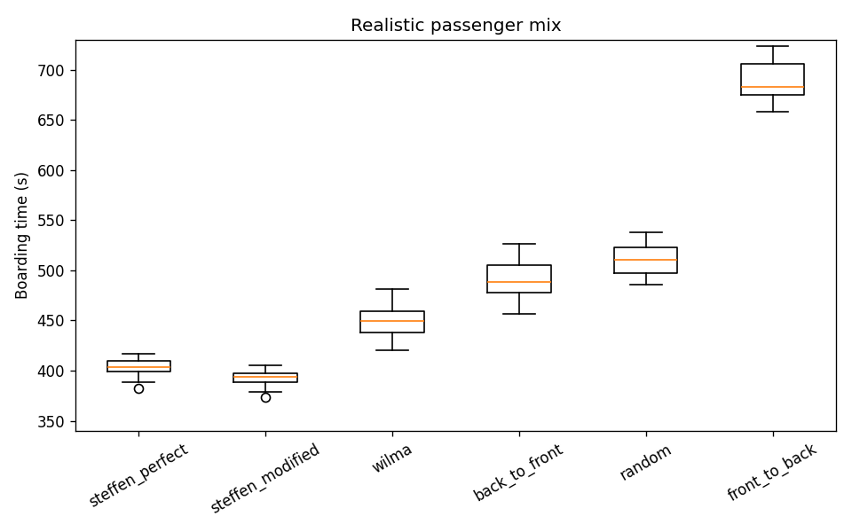

# Heterogeneous Passenger Mix — Results

**Date:** 2026-06-10
**Spec:** `docs/heterogeneous-profiles-design.md`
**Reproduce:** `python -m boarding --mix --seeds 20 --rows 30 --out docs/study-output`
**Artifacts:** `docs/study-output/ranking_mix.csv`, `results_mix.csv`, `boarding_times_mix.png`

## What changed vs the baseline

The baseline study treats all 180 passengers identically (uniform walk speed, one luggage
distribution, no mobility difference). This run instead assigns each seat's occupant a **profile**
drawn from the realistic mix below, which modulates walk speed (× `v0`), luggage-stow time, and how
slowly they shuffle past seated neighbours (× the seat-interference penalty):

| Profile          | Share | Walk speed × | Stow mean (s) | Stow sd (s) | Mobility × | Who |
|------------------|-------|--------------|---------------|-------------|------------|-----|
| standard         | 45%   | 1.00         | 7             | 3           | 1.0        | typical adult, one bag |
| business_young   | 15%   | 1.15         | 2             | 1           | 0.9        | fast, little/no bag |
| heavy_luggage    | 15%   | 0.95         | 14            | 5           | 1.2        | two bags, slow stow |
| elderly          | 15%   | 0.60         | 10            | 4           | 1.8        | slow walk, slow shuffle |
| family_with_kids | 10%   | 0.70         | 16            | 6           | 2.0        | kids + multiple bags, slowest |

(Values from `DEFAULT_MIX` in `src/boarding/profiles.py`.) Profiles are seed-paired across methods,
so the only thing that differs between methods is still the boarding order.

## Ranking under the realistic mix (20 seeds)

| Rank | Method            | Mean (s) | Std (s) | Homogeneous mean (s) | Inflation |
|------|-------------------|----------|---------|----------------------|-----------|
| 1    | steffen_modified  | 391.9    | 8.5     | 378.9                | **+3.4%** |
| 2    | steffen_perfect   | 403.6    | 8.8     | 371.0                | **+8.8%** |
| 3    | wilma             | 449.6    | 16.0    | 402.2                | +11.8%    |
| 4    | back_to_front     | 490.8    | 18.7    | 443.0                | +10.8%    |
| 5    | random            | 511.3    | 16.6    | 455.9                | +12.2%    |
| 6    | front_to_back     | 688.6    | 19.5    | 615.0                | +12.0%    |

## Findings

**1. The optimized methods still win, but Steffen-Perfect loses its crown.** Under a homogeneous
crowd, Steffen-Perfect is fastest (371 s) with Steffen-Modified just behind (379 s). Under a
realistic mix the two **swap**: Steffen-Modified becomes fastest (392 s) and Steffen-Perfect drops
to second (404 s). The broad ordering (Steffen methods < WilMA < block methods < front-to-back) is
otherwise preserved.

**2. The "perfect" method is the most fragile of the optimized methods.** Steffen-Perfect inflates
**+8.8%** under heterogeneity — more than twice Steffen-Modified's **+3.4%**, and the largest jump of
any method relative to its own efficiency. Its advantage comes from maximal spacing that lets many
passengers stow luggage in parallel; that choreography assumes interchangeable passengers. Inject a
slow elderly passenger or a family into a perfectly-spaced sequence and the parallel stowing it
depends on stalls. Steffen-Modified's coarser 4-group ordering has more slack and absorbs the
variation. This is a concrete, quantified version of the standard real-world criticism of Steffen's
method — its theoretical edge erodes precisely where real passengers differ from the ideal.

**3. Everyone slows down; the slack methods slow most in absolute terms but least in proportion to
the optimized ones.** Random and the block methods inflate ~11-12%, similar to front-to-back. The
optimized methods inflate less (Steffen-Modified +3.4%, Steffen-Perfect +8.8%), so the *gap* between
best and worst persists — heterogeneity raises the floor without collapsing the ranking, except at
the very top.

## Caveat

The profile multipliers are illustrative, not calibrated against boarding-time field data. The
qualitative findings — Steffen-Modified overtaking Steffen-Perfect, and Steffen-Perfect being the
most heterogeneity-sensitive optimized method — follow from the *relative* ordering of the
multipliers (perfect spacing is more sensitive to per-passenger variance than coarse grouping), and
are robust to the exact numbers. A future sensitivity sweep over the slow-passenger fraction would
quantify at what mix level the crown actually changes hands.

